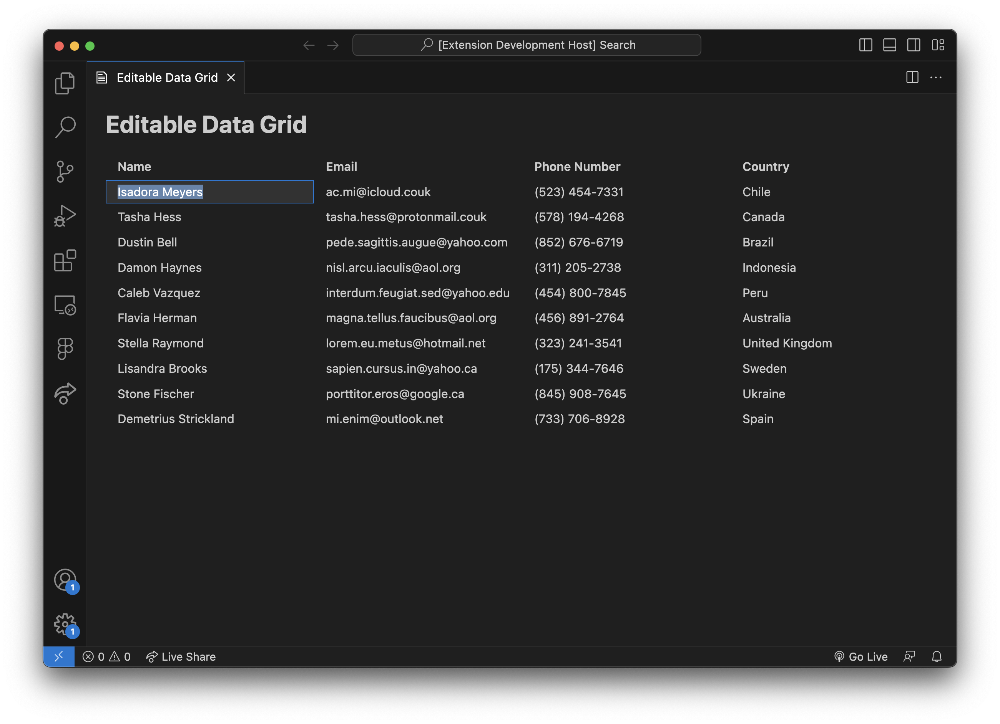

# Editable Data Grid Sample Extension

This is a sample extension that demonstrates a reference/workaround implementation for making the `vscode-data-grid` component editable.



## Context

> **Warning**<br>
> This is not a fully tested (nor first-party) editable data grid. Proceed with caution.

There have been many requests (such as [this issue](https://github.com/microsoft/vscode-webview-ui-toolkit/issues/493)) asking for a more interactive data grid.

The Webview UI Toolkit is implemented using a set of unstyled based components from [FAST](https://www.fast.design/). They offer a `data-grid` component which, at this time, statically renders data in a table-like format but does not implement any APIs for interactivity or editability.

Because FAST owns the underlying data grid implementation, first-party support for interactivity will need to come from them. With that said, workaround solutions are possible and this sample extension demonstrates one such solution (initially inspired by [another solution](https://github.com/microsoft/vscode-webview-ui-toolkit/issues/493#issuecomment-1603559439) from [@worksofliam](https://github.com/worksofliam)).

Issues and improvements to this solution are welcomed and encouraged!

## Features

This solution implements the following features:

- Editable data grid cells using the `contenteditble` attribute
- Keyboard shortcuts to enter/exit edit mode
  - `Enter`: Will toggle between edit modes when focused on a given cell
  - `Escape`: Will exit edit mode when focused on a given cell
- Mouse click and blur will enter/exit edit mode
- Cell text will be automatically highlighted when entering edit mode
- Cell changes will be synced with the underlying `vscode-data-grid` data structure

## Known issues

- Arrow keys don't work in edit mode

## Run The Sample

```bash
# Copy sample extension locally
npx degit microsoft/vscode-webview-ui-toolkit-samples/default/editable-data-grid editable-data-grid

# Navigate into sample directory
cd editable-data-grid

# Install sample dependencies
npm install

# Open sample in VS Code
code .
```

Once the sample is open inside VS Code you can run the extension by doing the following:

1. Press `F5` to open a new Extension Development Host window
2. Inside the host window, open the command palette (`Ctrl+Shift+P` or `Cmd+Shift+P` on Mac) and type `Editable Data Grid: Show`
