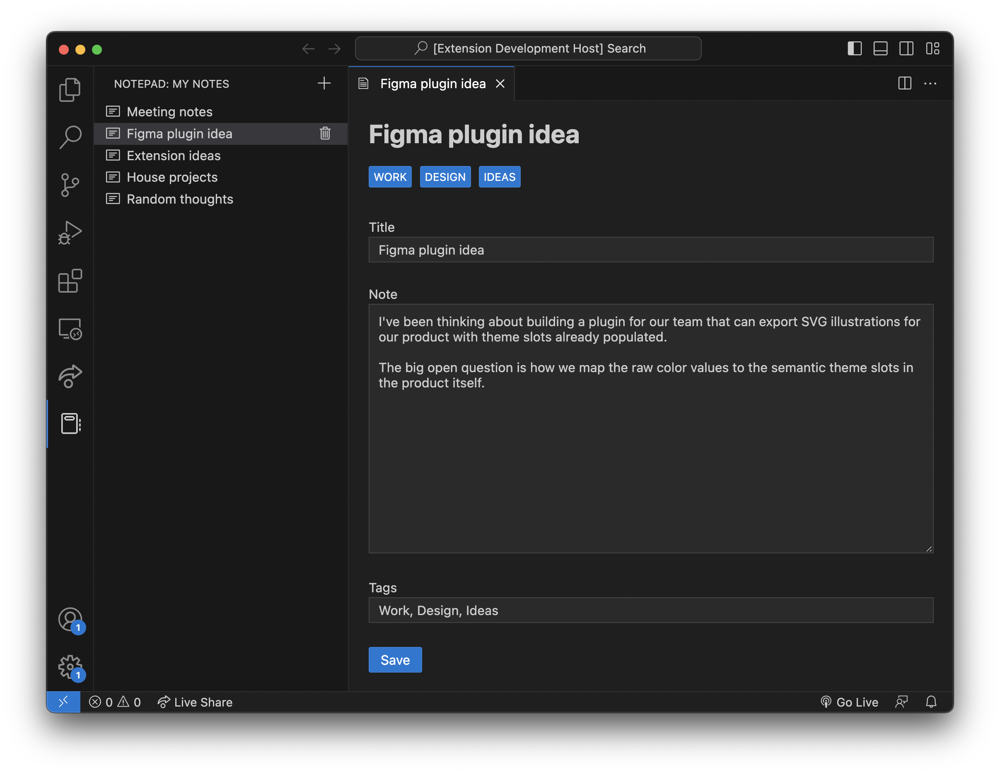

# Notepad Sample Extension

This sample extension showcases the toolkit in the context of a simple notepad experience that leverages the [TreeView API](https://code.visualstudio.com/api/extension-guides/tree-view) and [Webview API](https://code.visualstudio.com/api/extension-guides/webview).



## Run The Sample

```bash
# Copy sample extension locally
npx degit microsoft/vscode-webview-ui-toolkit-samples/default/notepad notepad

# Navigate into sample directory
cd notepad

# Install sample dependencies
npm install

# Open sample in VS Code
code .
```

Once the sample is open inside VS Code you can run the extension by doing the following:

1. Press `F5` to open a new Extension Development Host window
2. Click on the notebook icon in the VS Code activity bar
