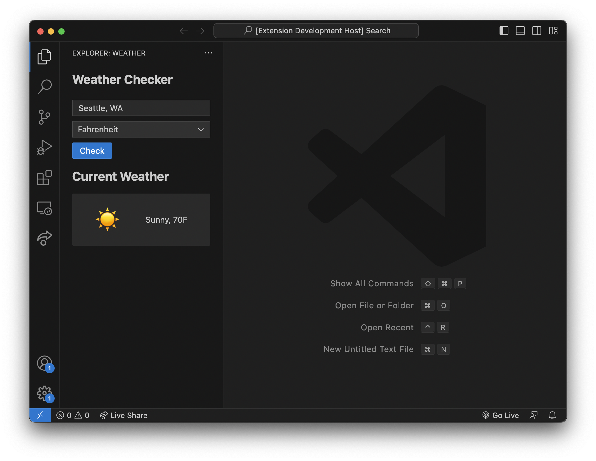

# Weather Webview Sample Extension

This sample extension demonstrates the Webview UI Toolkit for Visual Studio Code being used within a Webview View.



## Run The Sample

```bash
# Copy sample extension locally
npx degit microsoft/vscode-webview-ui-toolkit-samples/default/weather-webview weather-webview

# Navigate into sample directory
cd weather-webview

# Install sample dependencies
npm install

# Open sample in VS Code
code .
```

Once the sample is open inside VS Code you can run the extension by doing the following:

1. Press `F5` to open a new Extension Development Host window
2. Inside the host window, open the command palette (`Ctrl+Shift+P` or `Cmd+Shift+P` on Mac) and type `Explorer: Focus on Weather View`