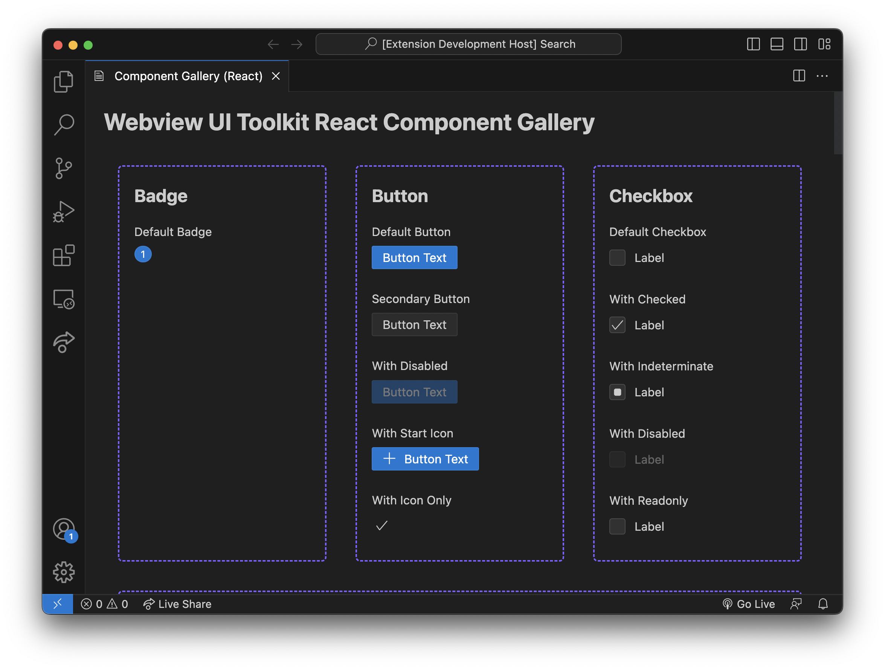

# Component Gallery (React)

This sample extension demonstrates every React component in the Webview UI Toolkit for Visual Studio Code.



## Run The Sample

```bash
# Copy sample extension locally
npx degit microsoft/vscode-webview-ui-toolkit-samples/frameworks/component-gallery-react component-gallery-react

# Navigate into sample directory
cd component-gallery-react

# Install dependencies for both the extension and webview UI source code
npm run install:all

# Build webview UI source code
npm run build:webview

# Open sample in VS Code
code .
```

Once the sample is open inside VS Code you can run the extension by doing the following:

1. Press `F5` to open a new Extension Development Host window
2. Inside the host window, open the command palette (`Ctrl+Shift+P` or `Cmd+Shift+P` on Mac) and type `Component Gallery (React): Show`
