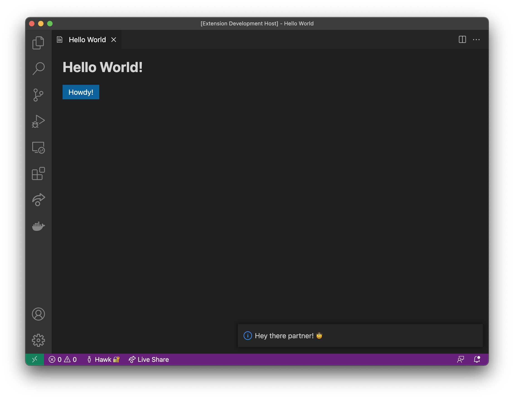

# Hello World Webview Sample Extension

This is the sample extension that goes along with the Webview Toolkit [Getting Started Guide](https://github.com/microsoft/vscode-webview-toolkit/blob/main/docs/getting-started.md).



## Running The Samples

To run the sample locally you will need to clone this entire repository and use your terminal to navigate to this directory. Inside the directory you can run the following commands:

```bash
# Install dependencies
npm install
# Open the project inside VS Code
code .
```

Once the sample project is open inside VS Code you can run the extension by doing the following:

- Press `F5` to open a new window with the extension loaded.
- Open the command palette by pressing (`Ctrl+Shift+P` or `Cmd+Shift+P` on Mac) and type `Hello World`.