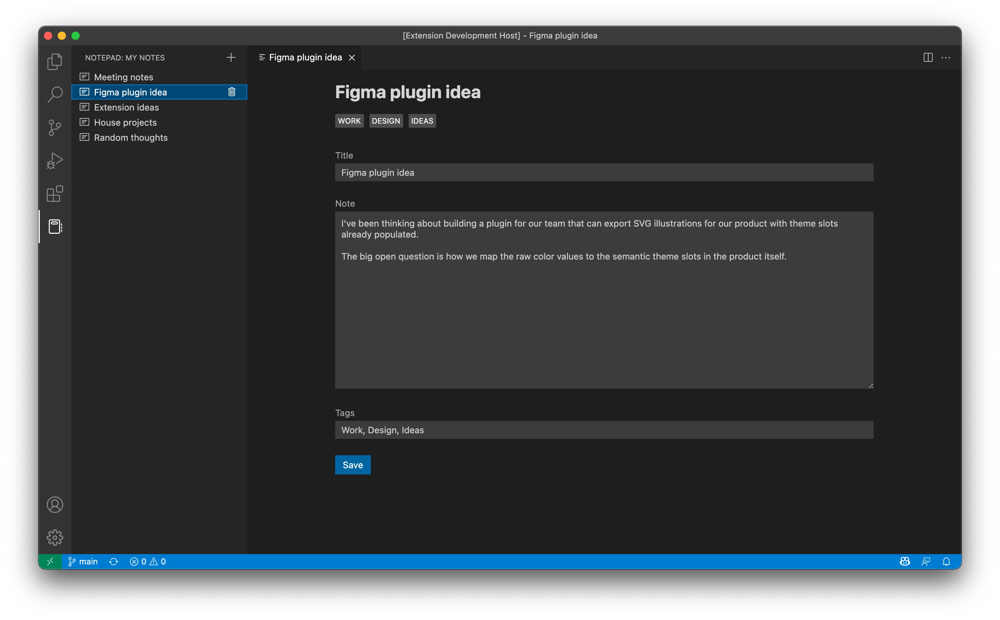

# Notepad Sample Extension

This is a sample extension that showcases the toolkit in the context a simple notepad experience that leverages the VS Code TreeView and Webview APIs.

## Running The Sample

To run the sample locally you will need to clone this entire repository and then open this specific folder inside Visual Studio Code.

Once the sample is open inside VS Code you can run the extension by doing the following:

1. Run `npm install` to install the extension dependencies
2. Press `F5` to open a new Extension Development Host window
3. Click on the notebook icon in the VS Code activity bar
