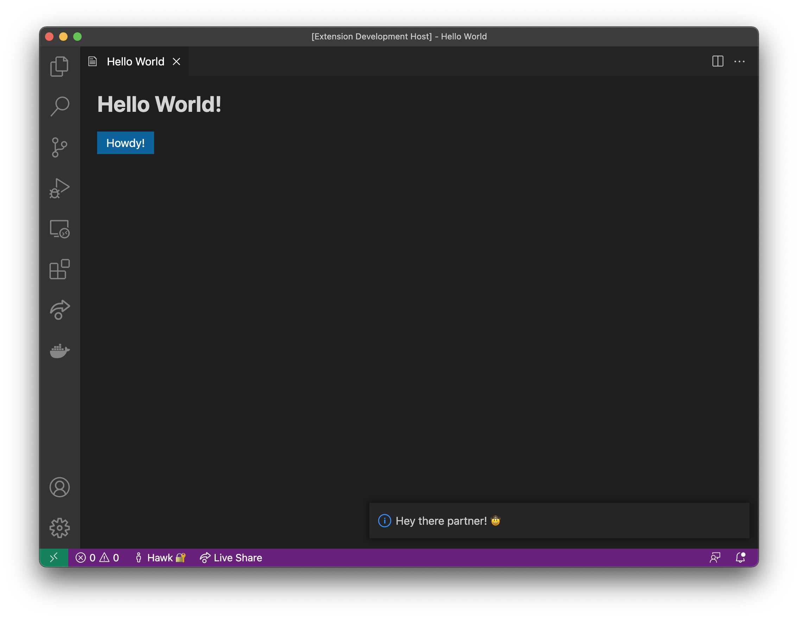

# Hello World React Sample Extension

This is a React-based reimplementation of the default [hello-world](../default/hello-world) sample extension that demonstrates how to set up and use a React + Webview UI Toolkit webview extension.



## Documentation

For a deeper dive into how this sample works, [read the documentation](./docs/react-toolkit-guide).

## Run The Sample

```bash
# Copy sample extension locally
npx degit microsoft/vscode-webview-ui-toolkit-samples/react/hello-world hello-world-react

# Navigate into sample directory
cd hello-world-react

# Install dependencies for both the extension and React source code
npm run install:all

# Build React webview code
npm run build:react

# Open sample in VS Code
code .
```

Once the sample is open inside VS Code you can run the extension by doing the following:

1. Press `F5` to open a new Extension Development Host window
2. Inside the host window, open the command palette (`Ctrl+Shift+P` or `Cmd+Shift+P` on Mac) and type `Hello World`
