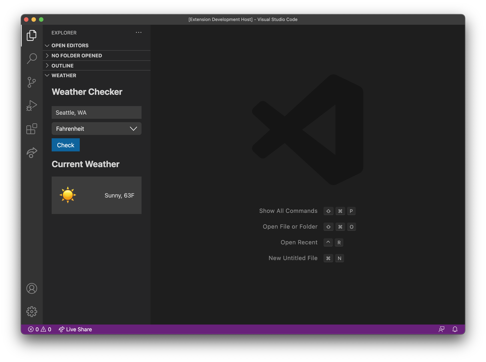

# Weather Webview Sample Extension

This sample extension demonstrates the Webview UI Toolkit for Visual Studio Code being used within a Webview View.



## Running The Samples

To run the sample locally you will need to clone this entire repository and use your terminal to navigate to this directory. Inside the directory you can run the following commands:

```bash
# Install dependencies
npm install
# Open the extension inside VS Code
code .
```

Once the sample extension is open inside VS Code you can run the extension by doing the following:

- Press `F5` to open a new Extension Development Host window.
- Open the command palette by pressing (`Ctrl+Shift+P` or `Cmd+Shift+P` on Mac) and type `Explorer: Focus on Weather View`.