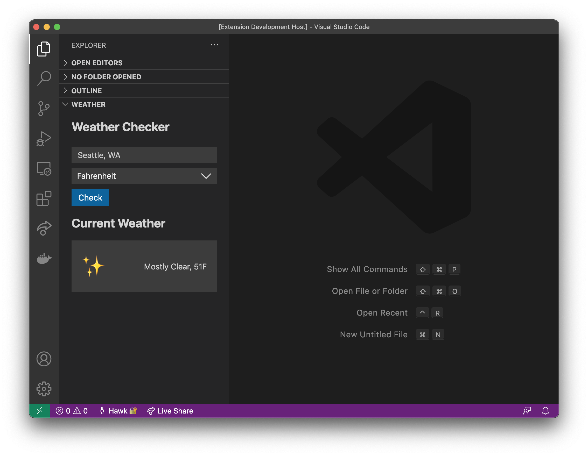

# Weather Webview Sample Extension

This sample extension demonstrates the Webview UI Toolkit for Visual Studio Code being used within a Webview View.

## Running The Sample

To run the sample locally you will need to clone this entire repository and then open this specific folder inside Visual Studio Code.

Once the sample is open inside VS Code you can run the extension by doing the following:

1. Run `npm install` to install the extension dependencies
2. Press `F5` to open a new Extension Development Host window
3. Inside the host window, open the command palette (`Ctrl+Shift+P` or `Cmd+Shift+P` on Mac) and type `Explorer: Focus on Weather View`